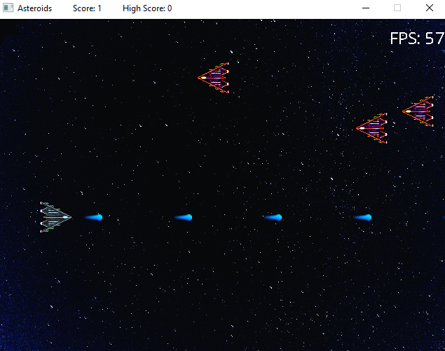

# CPPND: Capstone Asteroid Game

Asteroid is a classic 2D space shooting video game, which consists of a player that shoots bullets and destroys enemies. Enemies can also destroy the player by shooting bullets.

The keyboard controls for the paddle are as follows:

- 'arrow keys': moving player up/down/forward/right
- 'left control': shoots bullet
- 'spacebar': starts game for the fist time or restarts the game

High score of the player is stored.

## Rubric requirements

1. > Loops, Functions, I/O
   - The project accepts user input and processes the input (see Controller::HandleInput).
2. > Object Oriented Programming
   - The project uses Object Oriented Programming techniques.
   - Classes use appropriate access specifiers for class members.
   - Class constructors utilize member initialization lists.
3. > Memory Management
   - The project follows the Rule of 5 (see Entity class).
   - The project uses smart pointers instead of raw pointers (See Game class).
4. > Concurrency
   - The project uses multithreading (see Game::Run).
   - A mutex or lock is used in the project (see Game::calcFrameRate).

## Acknowledgement

This project is based on the starter repo for the Capstone project in the [Udacity C++ Nanodegree Program](https://www.udacity.com/course/c-plus-plus-nanodegree--nd213).
